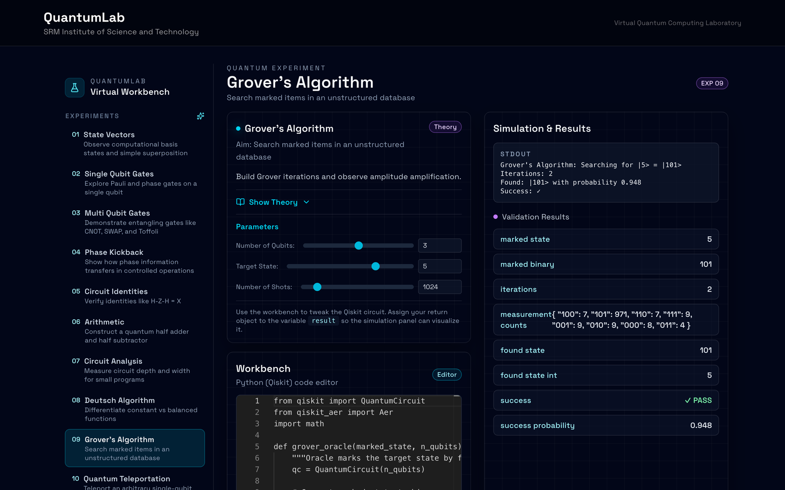
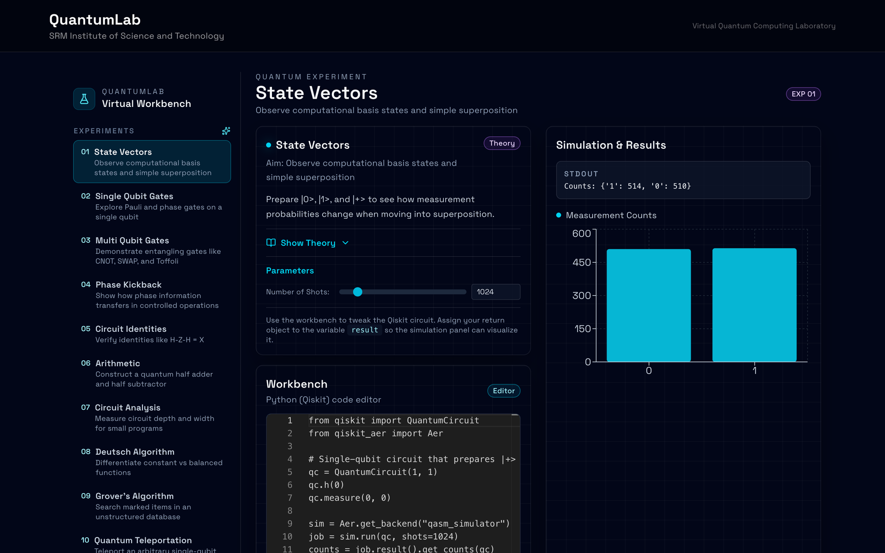

# Quantum Classroom - QuantumLab

[](https://github.com/ZANYANBU/Quantum-Classroom/actions/workflows/ci.yml)
[](https://www.ibm.com/quantum/qiskit)
[](https://nextjs.org)
[](https://fastapi.tiangolo.com)

**A side project: a browser lab that runs real Qiskit circuits**

**[Try the live demo](https://zanyanbu.github.io/Quantum-Classroom/)** — all 12 experiments in the browser. The demo has no backend, so *Run* replays a result recorded from a real run; clone the repo to execute your own code.

> An interactive full-stack educational platform for learning quantum computing through hands-on experiments using Qiskit.

<p align="center"></p>
<p align="center"><i>Experiment 9, Grover's Algorithm: the Qiskit code runs on the backend and the result panel checks the answer.</i></p>

<p align="center"></p>

**Developed by:** V. Anbuchelvan  
**Institution:** SRM Institute of Science and Technology  
**Purpose:** A side project built for a quantum computing course

---

## 📖 Project Description

QuantumLab is a modern web-based quantum computing laboratory designed to provide students and educators with an interactive platform for learning quantum algorithms and principles. The platform combines theoretical foundations with practical implementations, allowing users to write, execute, and visualize quantum circuits in real-time.

### Key Highlights

- **Full-Stack Architecture**: Next.js frontend with FastAPI backend
- **Real Qiskit Integration**: Execute actual quantum code with Qiskit Aer simulator
- **12 Validated Experiments**: Covering fundamentals to advanced quantum algorithms
- **Educational Focus**: Each experiment includes comprehensive theory, aims, and expected results
- **Interactive Learning**: Live code editing with instant execution and visualization
- **Modern UI/UX**: Dark quantum-themed interface with glass morphism design

---

## 🎯 Features Overview

### Frontend Technologies
- **Framework**: Next.js 15.1 (App Router)
- **Styling**: Tailwind CSS with custom quantum theme
- **UI Components**: shadcn/ui with Radix UI primitives
- **Icons**: Lucide React
- **State Management**: Zustand for persistent experiment code
- **Code Editor**: Monaco Editor (VS Code engine) with Python syntax highlighting
- **Charts**: Recharts for measurement histograms and result visualization

### Backend Technologies
- **Framework**: FastAPI (Python)
- **Quantum SDK**: Qiskit 1.3.1 with Qiskit Aer
- **Limits**: 30-second execution timeout; the submitted code cannot call `open` or `compile` (it is not a full sandbox, see [Run it locally](#-run-it-locally))
- **API**: RESTful endpoints with CORS support

### Platform Features

✅ **Interactive Code Editor**
- Monaco-based Python editor with syntax highlighting
- Real-time code persistence per experiment
- Editable starter code for each experiment

✅ **Dynamic Parameter Controls**
- Slider controls for shots, qubit counts, and algorithm parameters
- Real-time parameter injection into code

✅ **Rich Visualizations**
- Measurement count bar charts with Recharts
- Statevector displays with complex number formatting (a + bi)
- Circuit metrics (depth, width, gate count)
- Validation success/failure indicators

✅ **Comprehensive Educational Content**
- Detailed theory sections with mathematical foundations
- Clear experiment aims and learning objectives
- Expected results and interpretations
- Practical applications and real-world relevance

✅ **Modern User Interface**
- Dark mode quantum theme with cyan accents
- Glass morphism panels with backdrop blur
- Radial gradient backgrounds
- Responsive design for all screen sizes

---

## 📚 Complete Lab Manual

### Experiment Catalog

The QuantumLab platform includes 12 comprehensive experiments organized into three learning tracks:

#### **Foundation Track (Experiments 1-3)**

##### Experiment 1: State Vectors
**Aim**: Observe computational basis states and simple superposition  
**Concepts**: Quantum state vectors, superposition, measurement collapse  
**Key Learning**:
- Understand |0⟩ and |1⟩ basis states
- Create superposition with Hadamard gate
- Observe probabilistic measurement outcomes
- Learn normalization condition |α|² + |β|² = 1

**Theory**: A qubit state is |ψ⟩ = α|0⟩ + β|1⟩ where measurement gives |0⟩ with probability |α|² and |1⟩ with probability |β|². The Hadamard gate creates equal superposition: H|0⟩ = (|0⟩ + |1⟩)/√2.

**Expected Results**: Approximately 50-50 distribution between '0' and '1' outcomes (512 counts each with 1024 shots).

---

##### Experiment 2: Single Qubit Gates
**Aim**: Explore Pauli and phase gates on a single qubit  
**Concepts**: Unitary operations, Pauli matrices, phase gates  
**Key Learning**:
- X gate (NOT): bit flip |0⟩ ↔ |1⟩
- Y gate: combined bit and phase flip
- Z gate: phase flip on |1⟩
- H gate: superposition creation
- S gate: π/2 phase rotation
- T gate: π/4 phase rotation

**Theory**: All quantum gates are unitary operators (U†U = I) that reversibly transform qubit states. Pauli gates form the foundation of quantum operations.

**Expected Results**: Complex statevector amplitudes showing phase and amplitude transformations.

---

##### Experiment 3: Multi-Qubit Gates
**Aim**: Implement CNOT, SWAP, and Toffoli gates  
**Concepts**: Entanglement, controlled operations, reversible computing  
**Key Learning**:
- CNOT: conditional bit flip creating entanglement
- SWAP: exchange states between qubits
- Toffoli (CCX): controlled-controlled-NOT for reversible logic
- Bell state creation: |Φ⁺⟩ = (|00⟩ + |11⟩)/√2

**Theory**: Multi-qubit gates create correlations impossible in classical systems. CNOT with Hadamard creates maximally entangled Bell states.

**Expected Results**: Bell state shows 50% |00⟩ and 50% |11⟩, demonstrating quantum correlation.

---

#### **Quantum Principles Track (Experiments 4-7)**

##### Experiment 4: Phase Kickback
**Aim**: Demonstrate phase transfer in controlled operations  
**Concepts**: Controlled gates, eigenvalues, phase propagation  
**Key Learning**:
- Understand phase kickback mechanism
- Observe phase transfer from target to control qubit
- Foundational principle for quantum algorithms

**Theory**: When a controlled-U gate acts on an eigenstate of U, the phase accumulates on the control qubit instead of the target. This is crucial for Deutsch-Jozsa and Grover's algorithms.

**Expected Results**: Phase appears on control qubit while target remains unchanged.

---

##### Experiment 5: Circuit Identities
**Aim**: Verify quantum circuit equivalences  
**Concepts**: Gate composition, circuit optimization  
**Key Learning**:
- H-Z-H = X identity
- Gate cancellation properties
- Circuit simplification techniques

**Theory**: Certain gate sequences are equivalent to simpler operations. Understanding these identities is crucial for circuit optimization.

**Expected Results**: Identical measurement outcomes for equivalent circuits.

---

##### Experiment 6: Quantum Arithmetic
**Aim**: Implement a quantum half adder  
**Concepts**: Reversible computing, quantum logic gates  
**Key Learning**:
- Compute sum and carry bits reversibly
- Use CNOT and Toffoli for arithmetic
- Foundation for quantum ALU design

**Theory**: Classical arithmetic can be implemented reversibly using quantum gates. Half adder: Sum = A ⊕ B, Carry = A ∧ B.

**Expected Results**: Correct sum and carry outputs for all input combinations (00, 01, 10, 11).

---

##### Experiment 7: Circuit Analysis
**Aim**: Measure circuit depth, width, and gate count  
**Concepts**: Circuit metrics, resource estimation  
**Key Learning**:
- Quantify circuit complexity
- Understand depth vs. parallelism tradeoffs
- Estimate execution time and resource requirements

**Theory**: Circuit depth measures sequential gate layers (impacts execution time), while gate count measures total resources needed.

**Expected Results**: Metrics showing circuit structure and complexity.

---

#### **Quantum Algorithms Track (Experiments 8-12)**

##### Experiment 8: Deutsch Algorithm
**Aim**: Classify balanced vs. constant functions with one query  
**Concepts**: Quantum parallelism, interference  
**Key Learning**:
- First quantum algorithm showing quantum advantage
- Use superposition to evaluate function globally
- Demonstrate exponential speedup potential

**Theory**: Classical approach requires 2 queries; quantum approach needs only 1. Uses phase kickback and interference to extract global function properties.

**Expected Results**: |0⟩ for constant function, |1⟩ for balanced function.

---

##### Experiment 9: Grover's Algorithm
**Aim**: Perform unstructured search with quadratic speedup  
**Concepts**: Amplitude amplification, oracle, diffusion operator  
**Key Learning**:
- Search unsorted database in O(√N) time
- Understand oracle and diffusion steps
- Learn amplitude amplification technique

**Theory**: Grover's algorithm provides quadratic speedup over classical search. It amplifies the amplitude of the target state through repeated oracle and diffusion operations.

**Expected Results**: High probability of measuring the marked item after optimal iterations.

---

##### Experiment 10: Quantum Teleportation
**Aim**: Transfer quantum states using entanglement  
**Concepts**: EPR pairs, Bell measurements, quantum communication  
**Key Learning**:
- Teleport unknown quantum states
- Use entanglement and classical communication
- Understand no-cloning theorem implications

**Theory**: Quantum teleportation transfers a quantum state from Alice to Bob using a shared Bell pair and 2 classical bits. The original state is destroyed (no-cloning).

**Expected Results**: Bob's qubit matches Alice's original state after correction.

---

##### Experiment 11: BB84 Quantum Key Distribution
**Aim**: Simulate quantum cryptography protocol  
**Concepts**: Quantum cryptography, eavesdropping detection  
**Key Learning**:
- Generate secure cryptographic keys
- Detect eavesdropping through disturbance
- Understand unconditional security

**Theory**: BB84 uses quantum properties to generate secret keys. Any eavesdropping attempt disturbs the quantum states, revealing the presence of an attacker.

**Expected Results**: Shared secret key between Alice and Bob with error detection.

---

##### Experiment 12: Quantum Fourier Transform
**Aim**: Implement QFT and inverse QFT  
**Concepts**: Fourier analysis, phase estimation, Shor's algorithm foundation  
**Key Learning**:
- Transform between computational and Fourier basis
- Foundation for period finding and factoring
- Exponentially faster than classical FFT

**Theory**: QFT maps |j⟩ → (1/√N)Σₖ e^(2πijk/N)|k⟩. It's the quantum version of the discrete Fourier transform and is essential for Shor's factoring algorithm.

**Expected Results**: Transformed statevector showing frequency domain representation.

---

## 🚀 Getting Started

### Prerequisites
- **Python 3.9+** with pip
- **Node.js 18+** with npm/yarn
- **Git** for version control

### Quick Start

#### 1. Clone the Repository
```bash
git clone https://github.com/ZANYANBU/Quantum-Classroom.git
cd Quantum-Classroom
```

#### 2. Backend Setup
```bash
cd api
python -m venv venv

# On Windows
.\venv\Scripts\activate
# On macOS/Linux
source venv/bin/activate

pip install -r requirements.txt
uvicorn main:app --reload --port 8000
```

The API will be available at **http://localhost:8000**

#### 3. Frontend Setup

Open a new terminal:

```bash
cd frontend
npm install
npm run dev
```

The application will open at **http://localhost:3000**

#### 4. Start Learning!

Navigate to **http://localhost:3000/experiments/exp-1** to begin with Experiment 1.

---

## 🏗️ Project Architecture

```
Quantum-Classroom/
├── api/                          # FastAPI Backend
│   ├── main.py                   # Main API with /execute endpoint
│   ├── requirements.txt          # Python dependencies (Qiskit, FastAPI)
│   ├── requirements-dev.txt      # Test dependencies (pytest, httpx)
│   ├── record_demo_results.py    # Records a real run of each experiment for the live demo
│   └── tests/                    # API tests, and all 12 experiments run end to end
│
├── frontend/                     # Next.js Frontend
│   ├── src/
│   │   ├── app/
│   │   │   ├── page.tsx          # Homepage
│   │   │   ├── layout.tsx        # Root layout with quantum theme
│   │   │   └── experiments/
│   │   │       ├── layout.tsx    # Experiment layout with sidebar
│   │   │       └── [slug]/
│   │   │           └── page.tsx  # Dynamic experiment pages
│   │   │
│   │   ├── components/
│   │   │   ├── experiment-workspace.tsx  # Main workspace component
│   │   │   ├── code-editor.tsx           # Monaco editor wrapper
│   │   │   ├── result-panel.tsx          # Results visualization
│   │   │   ├── sidebar.tsx               # Experiment navigation
│   │   │   └── ui/                       # shadcn/ui components
│   │   │
│   │   ├── lib/
│   │   │   ├── experiments.ts    # All 12 experiment definitions
│   │   │   └── utils.ts          # Utility functions
│   │   │
│   │   └── store/
│   │       └── experiment-store.ts  # Zustand state management
│   │
│   └── package.json              # Node dependencies
│
└── README.md                     # This file
```

### Data Flow

1. **User loads experiment** → Next.js renders page with experiment data from `experiments.ts`
2. **User edits code** → Monaco Editor updates → Zustand persists to localStorage
3. **User clicks "Run"** → POST request to `/api/execute` with code and parameters
4. **Backend executes** → Qiskit runs on the backend (30s timeout)
5. **Results returned** → JSON with stdout, result object, and errors
6. **Frontend visualizes** → Recharts renders histograms, formatted output displays

## 🎓 How to Use the Platform

### For Students

1. **Select an Experiment** - Click any experiment (Exp 1-12) from the sidebar
2. **Read the Theory** - Expand "Show Theory" to learn:
   - Mathematical foundations
   - Key quantum concepts
   - Expected results and interpretations
3. **Adjust Parameters** - Use sliders to modify:
   - Number of shots (measurement repetitions)
   - Qubit counts
   - Algorithm-specific parameters
4. **Edit the Code** - Modify Qiskit code in the Monaco editor:
   - Syntax highlighting enabled
   - Changes auto-save per experiment
   - Reset to default anytime
5. **Run Simulation** - Click "Run Simulation" to execute on the backend
6. **Analyze Results** - View:
   - **Console Output**: Step-by-step calculations
   - **Measurement Histograms**: Visual bar charts (for QASM results)
   - **Statevectors**: Complex amplitudes formatted as a+bi
   - **Validation Status**: ✓ PASS / ✗ FAIL indicators
   - **Circuit Metrics**: Depth, width, gate counts

### Example Workflow

```python
# Experiment 1: Modify to test different superpositions
from qiskit import QuantumCircuit
from qiskit_aer import Aer

qc = QuantumCircuit(1, 1)
qc.h(0)              # Try changing to qc.x(0) or qc.y(0)
qc.measure(0, 0)

sim = Aer.get_backend("qasm_simulator")
job = sim.run(qc, shots=1024)  # Adjust shots via slider
counts = job.result().get_counts(qc)

print("Counts:", counts)
result = counts
```

**Tip**: Always assign your final result to the `result` variable for visualization!
5. **Run Simulation** - Click "Run Simulation" to execute on the backend
6. **Analyze Results** - View:
   - Console output (stdout with calculation steps)
   - Measurement histograms (for QASM simulator counts)
   - Statevectors (complex amplitudes formatted as a+bi)
   - Validation results (✓ PASS / ✗ FAIL status for tests)

## 🔬 Student Learning Outcomes

After completing all 12 experiments, students will be able to:

### Knowledge Outcomes
- ✅ Understand quantum superposition and measurement collapse
- ✅ Explain quantum entanglement and Bell states
- ✅ Describe single-qubit and multi-qubit quantum gates
- ✅ Understand phase kickback and circuit identities
- ✅ Explain the principles of quantum algorithms

### Skills Outcomes
- ✅ Write Qiskit code to implement quantum circuits
- ✅ Create and measure quantum superposition states
- ✅ Implement entangled states using CNOT gates
- ✅ Build quantum algorithms (Deutsch, Grover, QFT)
- ✅ Design quantum communication protocols (Teleportation, BB84)
- ✅ Analyze circuit complexity (depth, width, gate count)
- ✅ Interpret measurement results and statevectors
- ✅ Optimize quantum circuits using gate identities

### Competency Mapping
- **Foundation Track (Exp 1-3)**: Basic quantum mechanics and gates
- **Principles Track (Exp 4-7)**: Advanced quantum phenomena and optimization
- **Algorithms Track (Exp 8-12)**: Industry-relevant quantum algorithms

---

## 🔌 API Documentation

### Execute Endpoint

**POST** `/api/execute`

Execute Qiskit code on the backend simulator.

**Request Body:**
```json
{
  "code": "from qiskit import QuantumCircuit\nqc = QuantumCircuit(1)\nresult = qc"
}
```

**Response:**
```json
{
  "stdout": "Counts: {'0': 512, '1': 512}\n",
  "result": {
    "0": 512,
    "1": 512
  },
  "error": null
}
```

**Error Response:**
```json
{
  "stdout": "",
  "result": null,
  "error": "NameError: name 'qc' is not defined"
}
```

### Health Check

**GET** `/health`

```json
{
  "status": "ok",
  "message": "QuantumLab API is running with Qiskit support"
}
```

---

## 🛠️ Troubleshooting

### Backend Issues

**Problem**: `ModuleNotFoundError: No module named 'qiskit'`  
**Solution**: Ensure virtual environment is activated and run `pip install -r requirements.txt`

**Problem**: `Port 8000 already in use`  
**Solution**: Use a different port: `uvicorn main:app --port 8001`

**Problem**: `Execution timeout errors`  
**Solution**: Reduce circuit complexity or shot count (limit is 30 seconds)

### Frontend Issues

**Problem**: `Cannot connect to API`  
**Solution**: 
- Verify backend is running on `http://localhost:8000`
- Check CORS settings in `api/main.py`
- Update `NEXT_PUBLIC_API_BASE` in `.env.local`

**Problem**: Code not persisting  
**Solution**: Check browser localStorage is enabled

**Problem**: Monaco editor not loading  
**Solution**: Ensure `npm install` completed successfully

### Common Qiskit Errors

**Problem**: `No backend found`  
**Solution**: Use `Aer.get_backend()` instead of deprecated `Aer.backends()`

**Problem**: `Invalid number of shots`  
**Solution**: Shots must be between 1 and 100,000

---

## 🔒 Run it locally

The backend runs whatever Python it is sent: that is how the lab executes your
Qiskit code. Run it on your own machine or a trusted network. Do not expose the
API to the internet as it is.

---

## 🧪 Running Tests

### Backend Tests
```bash
cd api
pip install -r requirements-dev.txt
pytest
```

The tests read the experiment code straight from `frontend/src/lib/experiments.ts`
and run it against the real backend, so they check what a student actually gets:

- all 12 experiments run and return a result
- every slider runs at its minimum and maximum
- the physics is right where a circuit has one answer (the half adder adds, Deutsch
  tells constant from balanced, Grover finds the marked state, BB84 keys match)
- the `/execute` endpoint reports errors and serialises complex amplitudes

The same tests, plus the frontend lint, type-check and build, run on every push
and pull request.

### Frontend Lint
```bash
cd frontend
npm run lint
```

### Build Production
```bash
cd frontend
npm run build
npm start
```

---

## 🛡️ Security & Validation

- **Restricted builtins**: Submitted code cannot call `open` or `compile`. Imports are allowed, so this is not a full sandbox
- **30-second Timeout**: Prevents infinite loops
- **Error Handling**: Clear error messages for debugging
- **Result Validation**: Automatic verification of expected outcomes
- **Type Safety**: TypeScript frontend with Pydantic backend

## 🏗️ Technology Stack Details

### Frontend Stack
| Technology | Version | Purpose |
|------------|---------|---------|
| **Next.js** | 15.1 | React framework with App Router |
| **TypeScript** | 5.x | Type-safe JavaScript |
| **Tailwind CSS** | 4.x | Utility-first CSS framework |
| **Monaco Editor** | Latest | VS Code editor for code editing |
| **Recharts** | 2.x | React charting library |
| **Zustand** | 5.x | Lightweight state management |
| **Radix UI** | Latest | Accessible UI primitives |
| **Lucide React** | Latest | Icon library |

### Backend Stack
| Technology | Version | Purpose |
|------------|---------|---------|
| **FastAPI** | Latest | Modern Python web framework |
| **Qiskit** | 1.3.1 | Quantum computing SDK |
| **Qiskit Aer** | Latest | High-performance quantum simulator |
| **Uvicorn** | Latest | ASGI server |
| **Pydantic** | Latest | Data validation |
| **NumPy** | Latest | Numerical computing |

### Development Tools
- **ESLint**: Code linting
- **Git**: Version control
- **VS Code**: Recommended IDE

---

## 📝 Environment Variables

Create `.env.local` in `frontend/`:
```env
NEXT_PUBLIC_API_BASE=http://localhost:8000
```

## 🧪 Testing Experiments

Each experiment includes:
- ✅ **Working Qiskit code** - Pre-validated and tested
- 📊 **Expected outputs** - Known correct results
- 🔍 **Self-validation** - Code verifies its own execution
- 📖 **Educational context** - Theory and practical applications

## 👨‍🏫 For Instructors and Educators

### Classroom Integration

This platform is designed to support various teaching methodologies:

#### 1. **Flipped Classroom Model**
- Students complete experiments before lecture
- Class time used for discussion and advanced topics
- Immediate feedback reduces grading workload

#### 2. **Self-Paced Learning**
- Students progress through experiments independently
- Built-in theory sections for autonomous learning
- Validation provides instant feedback

#### 3. **Lab Sessions**
- Use as virtual quantum lab (no hardware required)
- Hands-on experience with real Qiskit code
- Scalable to any class size

#### 4. **Assignments and Projects**
- Modify experiments for custom assignments
- Track student code variations
- Export results for grading

### Customization Options

#### Adding New Experiments
Edit `frontend/src/lib/experiments.ts`:

```typescript
{
  id: 13,
  slug: "exp-13",
  title: "Your Custom Experiment",
  aim: "Your learning objective",
  summary: "Brief description",
  theory: "Detailed theory with LaTeX",
  code: `# Your Qiskit starter code`,
  tags: ["custom", "advanced"],
  parameters: [
    { name: "shots", label: "Shots", default: 1024, min: 100, max: 8192 }
  ]
}
```

#### Modifying Experiment Code
All experiment starter code is in `experiments.ts` and fully editable.

#### Adjusting Execution Timeout
Edit `api/main.py` line 38:
```python
signal.alarm(30)  # Change to desired seconds (Unix only)
```

For Windows, modify the timeout logic in the `execute` endpoint.

### Assessment Integration

**Formative Assessment:**
- Built-in validation shows students if their code is correct
- Immediate feedback loop supports learning

**Summative Assessment:**
- Export student code modifications
- Require screenshot submissions of results
- Create custom experiments for exams

### Learning Pathways

**Beginner Track (Week 1-2):**
- Exp 1-3: Foundations

**Intermediate Track (Week 3-4):**
- Exp 4-7: Quantum principles

**Advanced Track (Week 5-6):**
- Exp 8-12: Quantum algorithms

---

## 🚀 Deployment

### Deploy Frontend (Vercel)

1. Push code to GitHub
2. Import project in Vercel
3. Set root directory to `frontend`
4. Add environment variable:
   ```
   NEXT_PUBLIC_API_BASE=https://your-api-url.com
   ```
5. Deploy

### Deploy Backend (Railway/Render)

> **Before you deploy:** the `/execute` endpoint runs any Python it receives and can
> import any module. Put the backend behind authentication, or run it in an isolated
> container that holds nothing you care about. See [Run it locally](#-run-it-locally).

**Railway:**
```bash
# Install Railway CLI
npm i -g @railway/cli

# Login and deploy
railway login
cd api
railway init
railway up
```

**Render:**
1. Create new Web Service
2. Connect GitHub repository
3. Set root directory: `api`
4. Build command: `pip install -r requirements.txt`
5. Start command: `uvicorn main:app --host 0.0.0.0 --port $PORT`

### Docker Deployment (Optional)

Create `Dockerfile` in `api/`:
```dockerfile
FROM python:3.11-slim
WORKDIR /app
COPY requirements.txt .
RUN pip install --no-cache-dir -r requirements.txt
COPY . .
CMD ["uvicorn", "main:app", "--host", "0.0.0.0", "--port", "8000"]
```

```bash
docker build -t quantumlab-api .
docker run -p 8000:8000 quantumlab-api
```

---

## 🤝 Contributing

Contributions are welcome! This project is designed for educational purposes.

### How to Contribute

1. **Fork the repository**
2. **Create a feature branch**: `git checkout -b feature/new-experiment`
3. **Make your changes**
4. **Test thoroughly**: Run all experiments
5. **Commit**: `git commit -m "Add Experiment 13: Shor's Algorithm"`
6. **Push**: `git push origin feature/new-experiment`
7. **Create Pull Request**

### Contribution Ideas

- 📚 Add more quantum algorithms (Shor's, VQE, QAOA)
- 🎨 Improve UI/UX design
- 📊 Add more visualization types
- 🧪 Create unit tests
- 📝 Improve documentation
- 🌍 Add internationalization
- ♿ Enhance accessibility

---

## 📊 Project Status

**Current Version**: 1.0.0  
**Status**: Production Ready ✅  
**Last Updated**: February 2026

### Completed Features
- ✅ 12 validated quantum experiments
- ✅ Full-stack implementation (Next.js + FastAPI)
- ✅ Real-time code execution
- ✅ Interactive visualizations
- ✅ Comprehensive theory sections
- ✅ State persistence
- ✅ Responsive design
- ✅ Error handling and validation

### Roadmap (Future Enhancements)
- 🔄 User authentication and progress tracking
- 📈 Advanced analytics dashboard
- 🎓 Certificate generation
- 👥 Multi-user collaboration
- 🔌 Integration with real quantum hardware (IBM Quantum)
- 📱 Progressive Web App (PWA) support
- 🌐 Multilingual support

---

## 📜 License

**Educational Use License**

This project is intended for educational purposes. Attribution to **V Anbuchelban** and **SRM Institute of Science and Technology** is required when:
- Using in classroom settings
- Modifying or extending the platform
- Publishing derived works

Free to use for:
- 🎓 Academic courses
- 📚 Self-study
- 🏫 Educational institutions
- 🔬 Research projects

---

## 📧 Contact & Support

**Developer**: V Anbuchelban  
**Institution**: SRM Institute of Science and Technology  
**Project**: Quantum Computing Practical Project

### Get Help
- 📖 Read the documentation above
- 🐛 Report issues on GitHub Issues
- 💡 Suggest features via Pull Requests

---

## 📄 License

Educational use. Attribution required.

## 🙏 Acknowledgments

### Technology Partners
- **IBM Qiskit Team**: For the excellent open-source quantum computing SDK
- **Vercel**: For Next.js framework and deployment platform
- **FastAPI**: For the modern Python web framework
- **shadcn/ui**: For beautiful, accessible UI components

### Educational Resources
This project was built as a practical application demonstrating:
- Full-stack web development
- Quantum computing fundamentals
- Educational platform design
- Modern DevOps practices

### Inspiration
Created to make quantum computing education accessible to all students, regardless of access to quantum hardware.

---

## 📸 Screenshots

### Experiment Workspace
![Experiment workspace showing code editor, theory section, and results visualization]

### Measurement Results
![Bar chart showing quantum measurement outcomes]

### Circuit Visualization
![Quantum circuit diagram with gates and measurements]

*Note: Add actual screenshots after deployment*

---

## 🌟 Star This Repo!

If you find this project helpful, please consider giving it a ⭐ on GitHub!

---

**Built with ❤️ for Quantum Education**  
*Making quantum computing accessible, one experiment at a time.*
